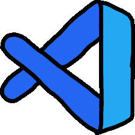
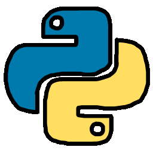
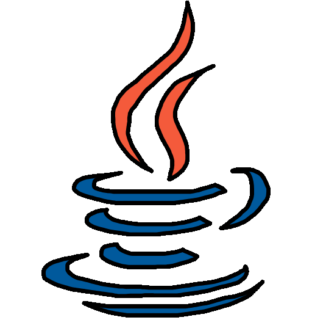
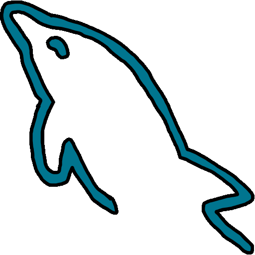
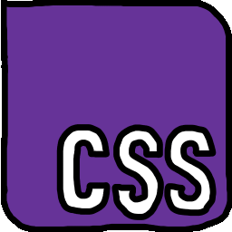

# Olá, me chamo Pedro Luiz 👋
<h3>Sobre mim</h3>

Sou um programador back-end curioso, dedicado e apaixonado em aprender. Sempre solucionando problemas, fazendo pequenos projetos e buscando aprender novas tecnologias.

* Atualmente estou aprendendo e estudando linguagem de programação Java
* Acesse meu repositorio de [Projetos](https://github.com/electronic0/Projetos) que eu faço durante o meu aprendizado
* Minhas [configurações](https://github.com/electronic0/electronic0/blob/main/config.txt) do Visual Studio Code.

### Linguagens e Ferramentas

    &nbsp;&nbsp;&nbsp;&nbsp;&nbsp;
    &nbsp;&nbsp;&nbsp;&nbsp;&nbsp;
    &nbsp;&nbsp;&nbsp;&nbsp;&nbsp;
    &nbsp;&nbsp;&nbsp;&nbsp;&nbsp;
    &nbsp;&nbsp;&nbsp;&nbsp;&nbsp;
    &nbsp;&nbsp;&nbsp;&nbsp;&nbsp;
    &nbsp;&nbsp;&nbsp;&nbsp;&nbsp;
    &nbsp;&nbsp;&nbsp;&nbsp;&nbsp;

